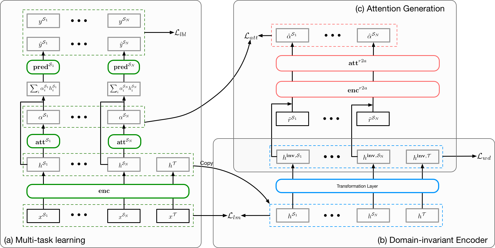
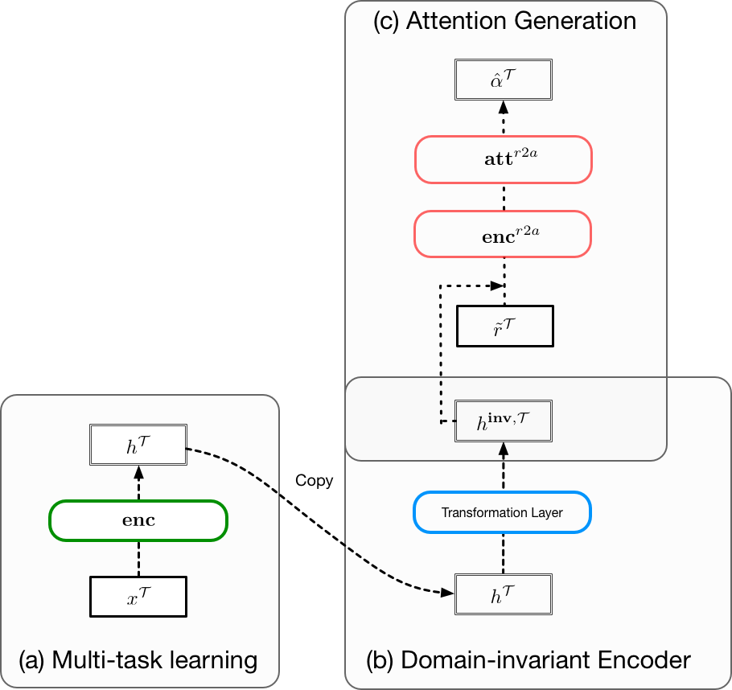

# R2A

There are four running modes: `train_r2a`, `test_r2a`, `train_clf`, `test_clf`. Pre-trained models can be downloaded from [here](https://people.csail.mit.edu/yujia/files/r2a/saved-runs.zip).


## Training R2A
The following command will train an R2A model on labeled beer reviews (beer look, aroma and palate) and unlabeled hotel reviews. The model that achieves the best overall loss on the source dev set will be saved under the directory `saved-runs/train_r2a/`.

```bash
python src/main.py --cuda --mode=train_r2a  --num_classes=1,1,1,2  --src_dataset=beer0,beer1,beer2 --tar_dataset=hotel  --l_wd=0.01 --l_r2a=0.01 --l_lm=0.1 --save
```
In the above example, we set <a href="https://www.codecogs.com/eqnedit.php?latex=\inline&space;\small&space;\lambda_{wd}=0.01,\&space;\lambda_{att}=0.01,\&space;\lambda_{lm}=0.1" target="_blank"></a>. To check other hyper-parameter options, run command `python src/main.py --help`.




## Testing R2A
Once the R2A has been trained, we can infer attention from human-annotated rationales on the target data. The following command load pre-trained model from `saved-runs/train_r2a/beer0-beer1-beer2_hotel_15250657265273020/best` and  human-annotated rationales from `../data/target/hotel_Location.train`. The R2A-generated attention will be saved at `../data/target/hotel_Location.pred_att.train`.

```bash
python src/main.py --cuda --mode=test_r2a  --num_classes=1,1,1,2  --src_dataset=beer0,beer1,beer2 --tar_dataset=hotel_Location  --snapshot=saved-runs/train_r2a/beer0-beer1-beer2_hotel_15250657265273020/best --test_path=../data/target/hotel_Location.train
```

<p align="center">

</p>


## Training target classifier
In order to make predictions on the target task, we need to train a target classifier. The following commands train an attention-based classifier for the task "hotel location" from the training data specified by `train_path`. The encoder is finetuned from the specified `snapshot`.

##### Supervised by label only (Trans)
```bash
python src/main.py --cuda --mode=train_clf  --num_classes=2  --src_dataset=hotel_Location  --snapshot=saved-runs/train_r2a/beer0-beer1-beer2_hotel_15250657265273020/best --train_path=../data/target/hotel_Location.pred_att.gold_att.train --l_r2a=0 --fine_tune_encoder
```
##### Supervised by rationales (RA-Trans)
```bash
python src/main.py --cuda --mode=train_clf  --num_classes=2  --src_dataset=hotel_Location  --snapshot=saved-runs/train_r2a/beer0-beer1-beer2_hotel_15250657265273020/best --train_path=../data/target/hotel_Location.pred_att.gold_att.train --l_r2a=1 --att_target=rationale --fine_tune_encoder
```
##### Supervised by R2A-generated attention (Ours)
```bash
python src/main.py --cuda --mode=train_clf  --num_classes=2  --src_dataset=hotel_Location  --snapshot=saved-runs/train_r2a/beer0-beer1-beer2_hotel_15250657265273020/best --train_path=../data/target/hotel_Location.pred_att.gold_att.train --l_r2a=1 --att_target=pred_att --fine_tune_encoder
```
##### Supervised by oracle attention (Oracle)
```bash
python src/main.py --cuda --mode=train_clf  --num_classes=2  --src_dataset=hotel_Location  --snapshot=saved-runs/train_r2a/beer0-beer1-beer2_hotel_15250657265273020/best --train_path=../data/target/hotel_Location.pred_att.gold_att.train --l_r2a=1 --att_target=gold_att --fine_tune_encoder
```
#### Learning oracle attention
If the argument `train_path` is not specified, it will load the oracle data to derive oracle attention. Here is an example
```bash
python src/main.py --cuda --mode=train_clf  --num_classes=2  --src_dataset=hotel_Location --l_r2a=0
```


## Testing target classifier
This mode is used for saving the oracle attention derived by the oracle target classifier. The following command load a trained classifier from `saved-runs/train_clf/hotel_Location__15258873065920606/best` and testing data from `../data/target/hotel_Location.train`. The attention derived by the target classifier will be saved at `../data/target/hotel_Location.gold_att.train`.

```bash
python src/main.py --cuda --mode=test_clf  --num_classes=2  --src_dataset=hotel_Location  --snapshot=saved-runs/train_clf/hotel_Location__15258873065920606/best --test_path=../data/target/hotel_Location.train
```
