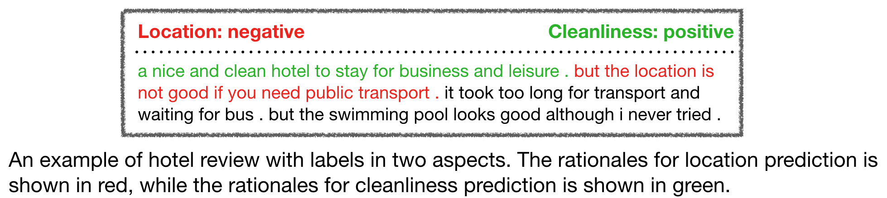
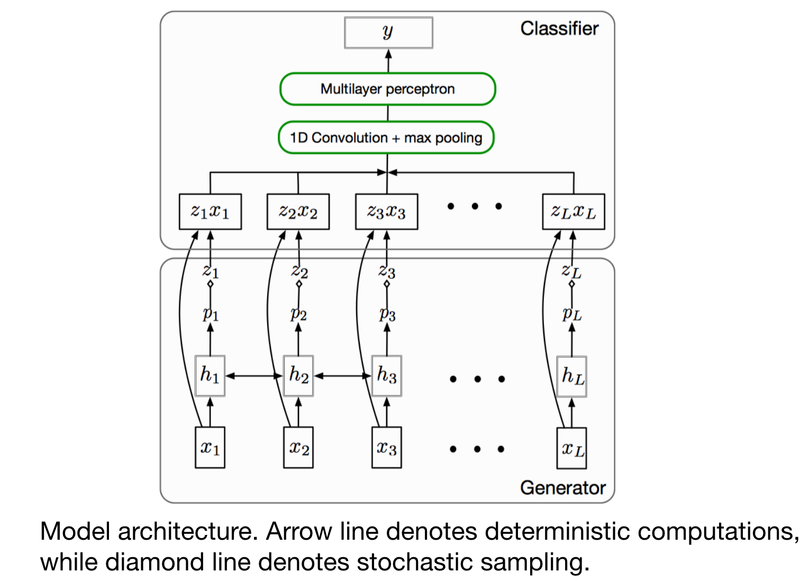

# Rationalizing neural predictions

This directory contains the code for automatic rationale generation. During training, the model only has access to the label and it needs to identify rationales in an unsupervised manner. The following figure shows an example of rationales in multi-aspect sentiment analysis. For more details, please read the original paper.

[**Rationalizing Neural Predictions**](https://arxiv.org/pdf/1606.04155.pdf). *Tao Lei, Regina Barzilay and Tommi Jaakkola. EMNLP 2016.*

<p align="center">
  
</p>


## Overview

The rationalization model is composed of two modular components: a generator and a classifier. The generator generates rationales from the input, and the classifier maps the generated rationales into the final label. The two components are trained jointly to minimize a loss function that favors short, concise rationales while enforcing that the rationales alone suffice for accurate prediction.

<p align="center">

</p>

**Key differences** between our implementation and the original implementation [(available here)](https://github.com/taolei87/rcnn/tree/master/code/rationale):
+ For the classifier, we use a CNN-based classifier instead of an RNN-based one. This leads to faster training.
+ We use the Gumbel trick (instead of REINFORCE) to sample rationales from the generator. We empirically found this stabalizes training.
+ To learn short and coherent rationales, the original implementation penalizes the L1 norm and the total variation of the selections. Empirically, we found it challenging to find a suitable weight for each regularization term. One explaination for this might be that the two regularizers are both linear with respect to the selections. 

  In our implementation, we instead use log-based regularizers. Specifically, to encourage short rationales, we penalize the cross entropy between the fractional counts of a word being selected as a rationale and a pre-defined hyper-parameter. This hyper-parameter can be interpreted as our prior on the length of the rationales. To encourage coherent rationales, we penalize the log probability of disconnected selections.
+ Since our focus is to generate a proxy for human-annotated rationales (instead of interpreting neural models), we use linguistic knowledge (e.g. dependency tree, POS tags) to post-process the selected rationales.

## Code usage
### Training
The following command trains a rationalization model to predict the look aspect of beer review. To check other hyper-parameter options, run command `python src/main.py --help`. 

```bash
python src/main.py --cuda --mode=train --dataset=beer0 --save
```

The model that achieves the best overall loss on the  dev set will be saved under the directory `saved-runs/`. The generated rationales for the training and development dataset are saved under `results_rat/beer0/`


### Testing
One can also use a trained rationalization model to generate rationales for a specified test data. For exxample, 
```bash
  python src/main.py --cuda --mode=test --dataset=beer0 --test_path=../data/source/beer0.train --snapshot=$SNAPSHOT
```
loads a trained model from `SNAPSHOT` and use it to generate rationales for the data file `../data/source/beer0.train`.
